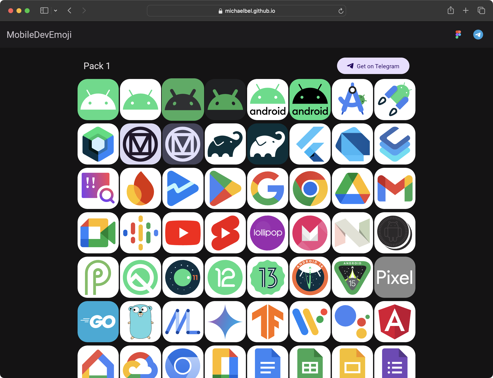
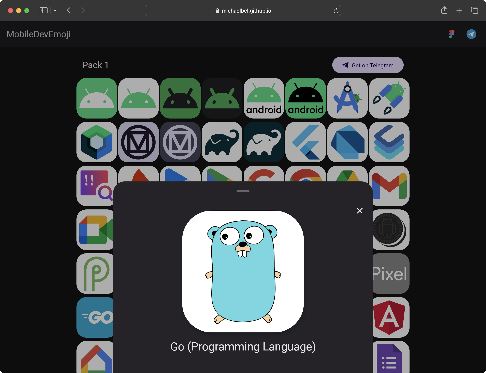

MobileDevEmoji
=

MobileDevEmoji - это набор эмодзипаков в Telegram. Они доступны пользователям с премиум подпиской. Наборы содержат 400 иконок в высочайшем качестве. Тематика - мобильная разработка и техсфера. Этот репозиторий хранит исходный код сайта, на котором ты можешь легко посмотреть описание каждого эмодзи.

## Screenshots

    
    

## Technologies

[![material3](https://img.shields.io/badge/Material3-004A76?&style=for-the-badge&logo=data:image/svg+xml;base64,PHN2ZyB4bWxucz0iaHR0cDovL3d3dy53My5vcmcvMjAwMC9zdmciIHdpZHRoPSI4MDBweCIgaGVpZ2h0PSI4MDBweCIgdmlld0JveD0iMCAwIDI0IDI0Ij4KICA8dGl0bGU+bWF0ZXJpYWxfZGVzaWduPC90aXRsZT4KICA8cmVjdCB3aWR0aD0iMjQiIGhlaWdodD0iMjQiIGZpbGw9Im5vbmUiLz4KICA8cGF0aCBkPSJNMjEsMTJhOSw5LDAsMCwwLTItNS42MlYxNy42M0E4Ljc4LDguNzgsMCwwLDAsMjEsMTJtLTMuMzcsN0g2LjM4YTkuNSw5LjUsMCwwLDAsMi42NywxLjQxQTguOTEsOC45MSwwLDAsMCwxMiwyMSw4Ljg2LDguODYsMCwwLDAsMTUsMjAuNDEsOS43Miw5LjcyLDAsMCwwLDE3LjYzLDE5TTExLDE3LDcsOXY4aDRtNi04LTQsOGg0VjltLTUsNS41M0wxNS43NSw3SDguMjVMMTIsMTQuNTNNMTcuNjMsNUE4LjkxLDguOTEsMCwwLDAsNi4zOCw1SDE3LjYzTTUsMTcuNjNWNi4zOEE5LDksMCwwLDAsMywxMmE4Ljc4LDguNzgsMCwwLDAsMiw1LjYzTTIzLDEyYTEwLjU3LDEwLjU3LDAsMCwxLTMuMjIsNy43OEExMC41NywxMC41NywwLDAsMSwxMiwyM2ExMC41OSwxMC41OSwwLDAsMS03Ljc4LTMuMjJBMTAuNTcsMTAuNTcsMCwwLDEsMSwxMiwxMC41OSwxMC41OSwwLDAsMSw0LjIyLDQuMjIsMTAuNTksMTAuNTksMCwwLDEsMTIsMWExMC41NywxMC41NywwLDAsMSw3Ljc4LDMuMjJBMTAuNTksMTAuNTksMCwwLDEsMjMsMTJaIiBmaWxsPSIjZmZmZmZmIi8+Cjwvc3ZnPg==&logoColor=white)](https://m3.material.io)
