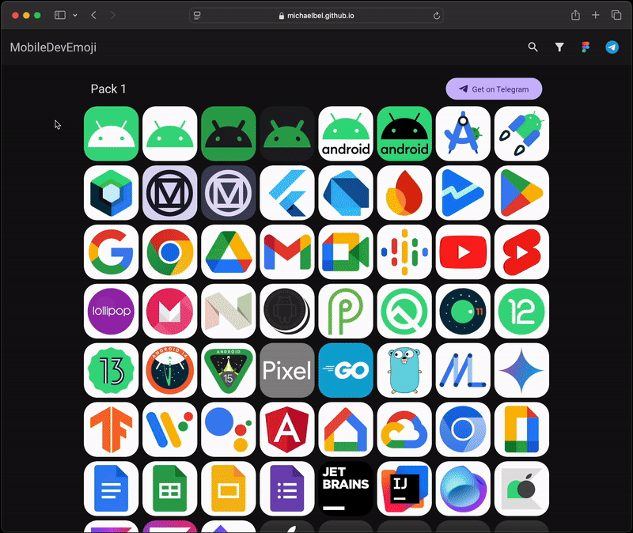
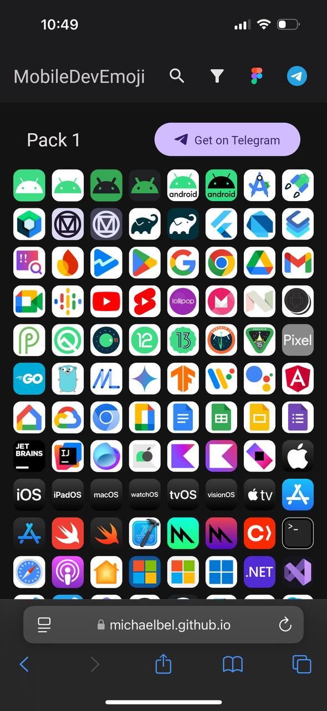
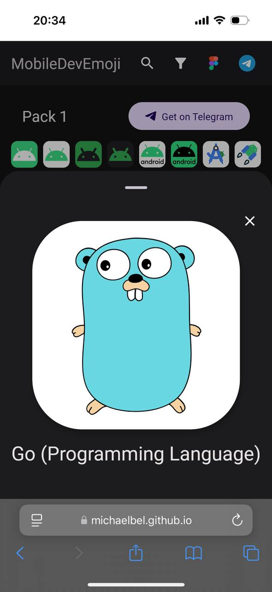
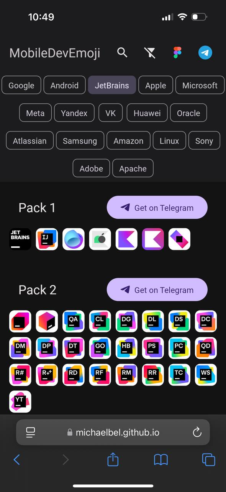
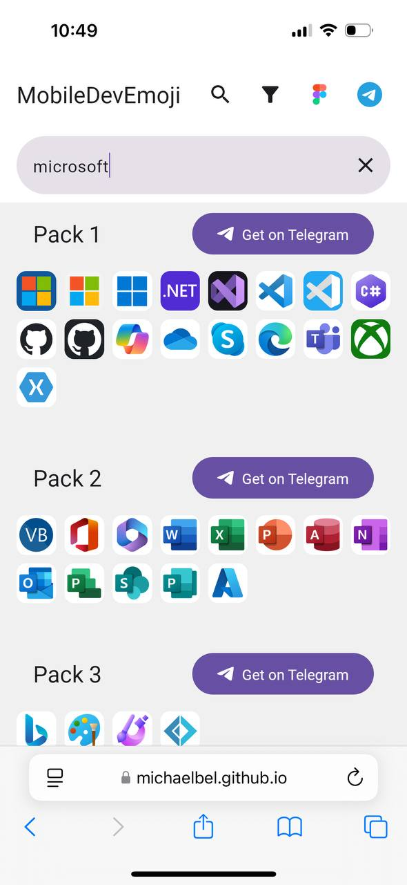
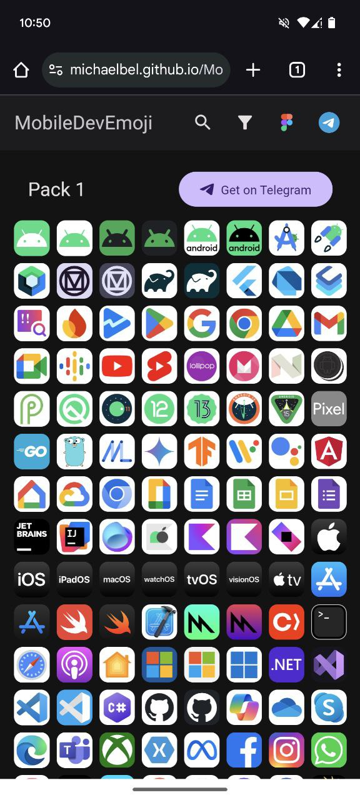
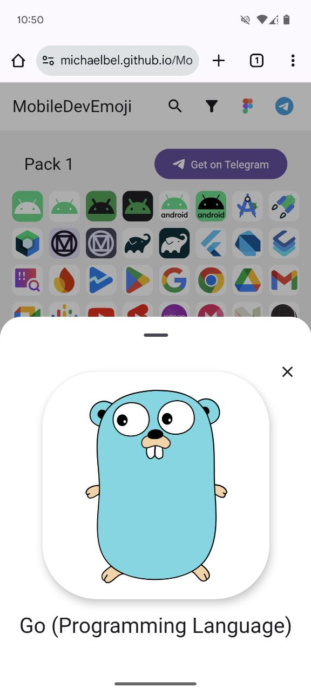
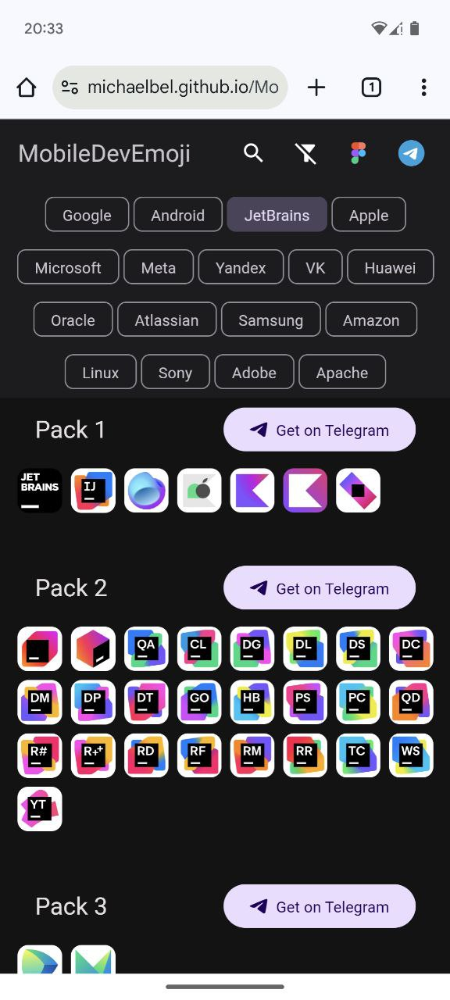
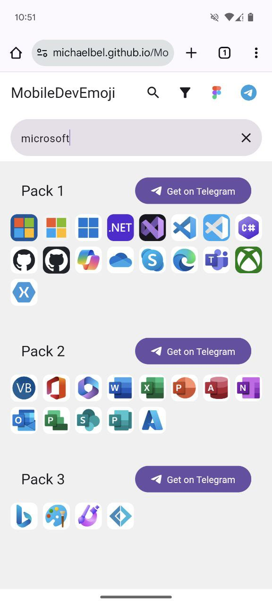

MobileDevEmoji
=

MobileDevEmoji – это набор эмодзипаков в Telegram. Они доступны пользователям с премиум подпиской. Наборы содержат 928 иконок в высочайшем качестве. Тематика – мобильная разработка и техсфера. Этот репозиторий хранит исходный код [сайта](https://michaelbel.github.io/MobileDevEmoji), на котором ты можешь легко посмотреть описание каждого эмодзи, а также воспользоваться поиском и фильтрами.

## Technologies

[![multiplatform](https://img.shields.io/badge/Multiplatform-AD4DB1?&style=for-the-badge&logo=&logoColor=white)](https://www.jetbrains.com/kotlin-multiplatform)

[![material3](https://img.shields.io/badge/Material3-004A76?&style=for-the-badge&logo=&logoColor=white)](https://m3.material.io)

## Screenshots
**Desktop (macOS Safari)**

    

 

**iOS (Safari)**

    
    
    
    

 

**Android (Chrome)**

    
    
    
    

